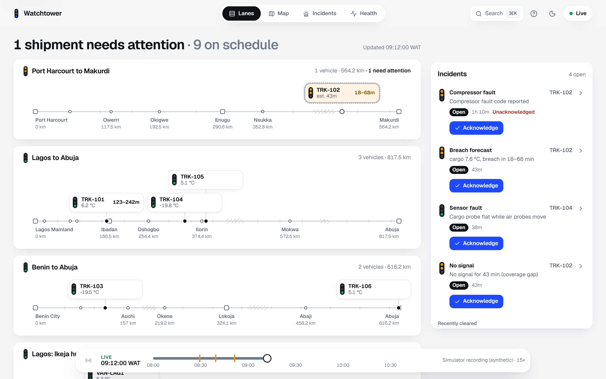
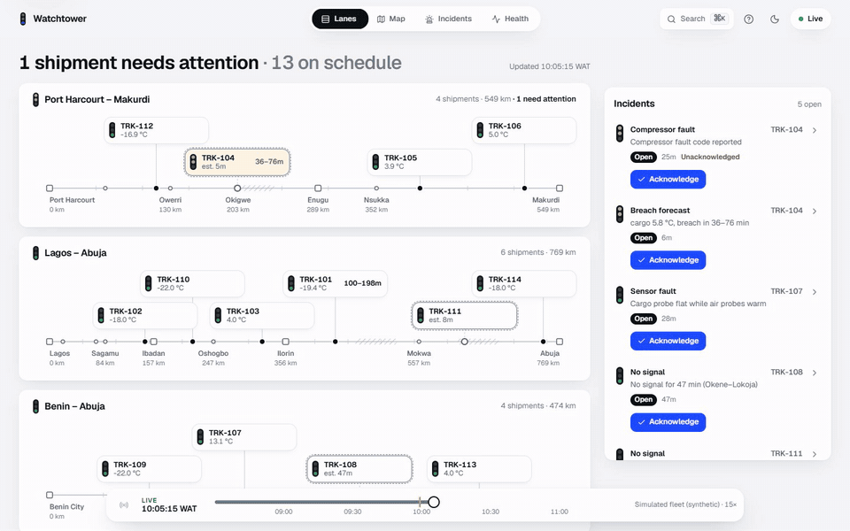
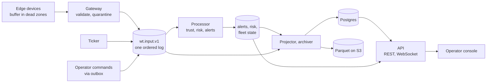

# Logistics Watchtower

**A cold-chain risk platform for refrigerated truck fleets on Nigerian roads.** Cargo spoils in the 30-40 °C heat while trucks cross long cellular dead zones. Watchtower's job is to tell an operator *which shipment will breach soonest, how sure the system is, why, and what to do*, before the cargo is lost.



<p align="center"></p>

> **Status: v2 rebuild in progress** (week 1 of 14; [plan](plan/Logistics%20Watchtower%202.0%20Rebuild%20Plan.md)). The console runs on a seeded **synthetic** fleet; the streaming services are designed but not built yet. Every number in this README links to the measurement that produced it. Anything unmeasured is called a target.

## What makes it different

Most fleet dashboards answer "is this truck over the threshold right now?" Watchtower is built to answer harder questions.

- **Forecast, with honest uncertainty.** Time-to-breach is reported as a p10-p90 range with a confidence, never a bare number. The console draws the forecast as a fan, distinct from measurements.
- **Sensors are not trusted blindly.** Every reading carries probe trust, so a stuck cargo probe is reported as "cargo temperature uncertain", not as an all-clear.
- **Dead zones are normal.** Devices buffer and replay. Late data updates its own minute bucket, and an alert learned late is still dated at its true event-time start.
- **Any incident can be replayed exactly.** Everything that can change an output passes through one ordered input log, so replaying the archive reproduces every alert ([ADR-0005](docs/adr/0005-single-ordered-input-log.md), [ADR-0015](docs/adr/0015-determinism-contract.md)).
- **A console designed for decisions.** Lanes are railway track diagrams and time-to-breach is a signal aspect, encoded by lamp position and count, not colour alone. One time handle replays every view at once ([console docs](docs/console/README.md)).

## Architecture


```mermaid
flowchart LR
  dev["Edge devices<br/>buffer in dead zones"] --> gw["Gateway<br/>validate, quarantine"]
  gw --> log[("wt.input.v1<br/>one ordered log")]
  tick["Ticker"] --> log
  cmd["Operator commands<br/>via outbox"] --> log
  log --> proc["Processor<br/>trust, risk, alerts"]
  proc --> out[("alerts, risk,<br/>fleet state")]
  out --> work["Projector, archiver"]
  log --> work
  work --> pg[("Postgres")]
  work --> s3[("Parquet on S3")]
  pg --> api["API<br/>REST, WebSocket"]
  out --> api
  api --> ui["Operator console"]
```

The processor is the single owner of alert state ([ADR-0006](docs/adr/0006-alert-lifecycle-single-owner.md)). Operator actions travel through the same log as telemetry, so escalation, replay and the audit trail all see one ordered history. See the [architecture overview](docs/architecture/overview.md) for component status, sequence diagrams, topics and the data model.

## Status

| Phase (plan section 18) | What exists | Status |
| --- | --- | --- |
| 0. Foundation | v1 frozen and audited; uv workspace; quality gates; CI workflow (not yet run on GitHub); Avro contracts (telemetry, input record) and event identity; Compose core stack; database schema; stateless ingest gateway with signed readings and quarantine (ADR-0021) | Done |
| 1. Reliable backbone | Device-scoped dedup, idempotent minute buckets, delta-returning `evaluate`, deterministic eviction; sensor trust and cargo fusion (all property-tested) | Started early; DLQ, engine spike and late-data lane planned |
| 2. Durable core | Schema with alerts, interventions, outbox and an append-only audit chain; the alert state machine with a single owner, as a pure function (ADR-0006) | Schema and state machine done; projector, outbox relay and API planned |
| 3. Data layer | Bronze bucket provisioned on SeaweedFS | Planned |
| 4. Decisions | Time-to-breach (exponential fit with a p10-p90 range), mean kinetic temperature, exposure and risk assessment (aspect, confidence, expected loss), composed by a pure vehicle evaluator: the processor's core | Started early; the processor's stream shell and console wiring planned |
| 5. Experience | Operator console: lanes, evidence layer, map (2D/3D), incidents, health, phone layouts, replay | In progress, on synthetic data |
| 6. Evidence | v1 runtime baseline | Planned |

Simulator v2 is merged (virtual clock; two-node reefer thermal model; real road routes; dead zones with edge buffering; sensor and device faults; city last-mile in Lagos and Abuja; seeded fleet days with ground-truth labels). Still to come: bulk mode, live mode with a control API, and the signed gateway sink.

## Quick start

Requires [uv](https://docs.astral.sh/uv/), Docker Desktop, Node.js 24+ and GNU Make. Windows notes are in the [local development guide](docs/guides/local-development.md).

```bash
make install    # Python workspace and git hooks
make check      # lint, pyright, fast tests (same as CI)
make up         # Redpanda, Schema Registry, Postgres/PostGIS, SeaweedFS, gateway
make migrate    # apply the database schema
make console    # console production build at http://localhost:4173
```

`make help` lists every target. Run `make test-integration` for the container-backed tests and `make console-check` for the console's lint, types, tests and build.

## Engineering highlights

Real decisions, with their trade-offs:

- **Measure first, then claim.** Before rebuilding anything, v1 was audited against its own README. It produced 108,683 alerts in 12 simulated hours from 3 trucks, masked 31,953 compressor faults behind other alerts, and raised its most frequent alert from a simulator artifact ([v1 audit](docs/audit/v1-baseline.md)). Its runtime baseline (3 to 2,000 trucks) was measured inside the Compose network so producer and client share one clock.
- **A startup race, found by measuring.** At 1,000 trucks, v1's dashboard showed zero alerts. The API had subscribed before the `alerts` topic existed, and only noticed it at librdkafka's 5-minute metadata refresh (297 s), skipping about 10,000 alerts. v2 creates every topic explicitly before any consumer starts, with auto-creation off.
- **Event identity that survives replay.** `event_id` is a UUIDv5 of device, boot and sequence number. Property testing found a crash on its first run: JSON can carry lone surrogates that UTF-8 can't encode. IDs are now restricted to a safe charset ([ADR-0002](docs/adr/0002-event-identity-and-idempotency.md)). The trade-off: the charset is now a contract with device firmware.
- **Order independence by construction.** Minute buckets accumulate integer hundredths, because float sums depend on order and would make a replay differ from the live run in the last bits. Property tests shuffle, duplicate and batch readings and assert identical state.
- **An adversarial architecture review, kept on record.** A fresh-context review found 32 issues in the original plan: two writers to alert state, a non-replayable stream, random alert IDs, and an archived object store (MinIO, verified via the GitHub API). The fixes are recorded in ADRs 0005-0018 ([review](docs/architecture/review-2026-10-05.md)).
- **Performance diagnosed, not guessed.** The console's map felt laggy. The measurement showed the dev server at 0.2-47.5 fps against **59.8-59.9 fps for the production build** on the reference laptop's GPU ([console docs](docs/console/README.md#performance)). Along the way, MapLibre's worker turned out to be missing from production builds, so the basemap never decoded tiles. Vite couldn't see the worker's computed URL; it's now bundled explicitly.
- **A forecast that never pretends to be exact.** When cooling fails, cargo approaches ambient exponentially, so time-to-breach is a least-squares fit of that curve. Residual scatter widens it into a p10-p90 range, and a property test pins that the estimate never grows as cargo warms. Learned models come only after they beat this transparent baseline (`packages/domain/src/watchtower_domain/forecast.py`).
- **Acknowledge only what the broker acknowledged.** The gateway answers 202 only after every record in a batch is acknowledged by Redpanda. Otherwise it returns 503 with `Retry-After`, and the device resends; deterministic `event_id`s make the repeats harmless. It stays stateless: sequence-reuse detection lives in the processor, because the plan's original "reject sequence regressions" rule would have quarantined every buffered replay ([ADR-0021](docs/adr/0021-gateway-contract-and-quarantine.md)).
- **Domain purity enforced by a test.** The domain package may import only the standard library, minus I/O, clocks and randomness. That makes it deterministic and reusable by the processor, the edge agent and replay.

## Repository

| Path | Contents |
| --- | --- |
| `apps/dashboard` | Operator console (React, Vite, MapLibre, deck.gl) |
| `apps/gateway` | Ingest gateway (FastAPI): validates and signature-checks readings, produces to `wt.input.v1` (ADR-0021) |
| `apps/simulator` | Simulator v2 (`wt-sim`): real OSRM road routes, two-node reefer thermal model, dead zones and edge buffering, sensor and device faults, city last-mile in Lagos and Abuja, seeded fleet days with ground-truth labels |
| `apps/dashboard-fixtures` | Recorded simulator runs for console development (schema in its README) |
| `packages/contracts` | Avro schemas, event identity |
| `packages/domain` | Pure domain logic: dedup, buckets, sensor trust, forecast, risk, alert state machine, vehicle evaluator |
| `packages/platform` | Kafka producer factory, Schema Registry client |
| `infra/compose` | Core stack and topic creation |
| `data/routes` | Corridor and city route geometry from OpenStreetMap via OSRM (ODbL) |
| `data/scenarios` | Seeded scenarios and their ground-truth labels |
| `migrations` | Alembic schema |
| `tests` | Unit, property, contract and integration tests |
| `docs` | Architecture, ADRs, audit, design, guides, devlog |
| `plan` | The rebuild plan |
| `legacy/v1` | Frozen v1, kept for the before-and-after comparison (also tagged `v1-final`) |

## Documentation

- [Architecture overview](docs/architecture/overview.md) and the [architecture review](docs/architecture/review-2026-10-05.md)
- [Architecture decision records](docs/adr/README.md)
- [Operator console](docs/console/README.md) and its [design brief](docs/design/console.md)
- [v1 audit and baseline](docs/audit/v1-baseline.md)
- [Local development](docs/guides/local-development.md) and [testing](docs/guides/testing.md)
- [Devlog](docs/devlog.md): surprises and measurements, day by day
- [Product record](PRODUCT.md)

## Limitations

- **No real fleet.** All data is synthetic. The console runs on a seeded timeline, and its time-to-breach comes from a provisional console-side estimator, not the risk engine.
- **The stream is only half built.** The gateway is built and produces to `wt.input.v1`, and the processor's core exists as a pure, tested function. But the stream shell that runs that core, the projector, the API and the archiver are still designed, not built, so nothing consumes the input log yet.
- **CI has not run remotely.** The workflow exists, and the same checks pass locally.
- **One laptop, single node.** The performance numbers come from one Windows laptop with integrated graphics and a single-node broker. Nothing here is a production claim.
- **Straight-line corridors in the console.** The simulator now has real OSRM road geometry, but the console still joins town coordinates with straight lines until it switches to the simulator's fixtures.
- **The plan is the plan.** The 14-week schedule is a target, and the [plan](plan/Logistics%20Watchtower%202.0%20Rebuild%20Plan.md) states its own risks.

## Author

**Emmanuel Richard**, Data Engineer · [GitHub](https://github.com/emmanuelrichard01)
