# 🚛 Logistics Watchtower

**Real-time cold chain fleet monitoring with sub-second anomaly detection.**

[](https://python.org)
[](https://fastapi.tiangolo.com)
[](https://redpanda.com)
[](https://docker.com)

---

## Overview

Cold chain logistics fail when cargo exceeds safe temperature thresholds. Traditional monitoring identifies spoilage only after delivery. **Logistics Watchtower** enables **real-time intervention** by streaming IoT telemetry through Kafka, detecting anomalies instantly, and pushing alerts to a live dashboard.

| Metric | Value |
|--------|-------|
| **End-to-end latency** | < 200ms |
| **Sensors per event** | 15+ data points |
| **Alert rules** | 8 types with severity |
| **API** | REST + WebSocket + Prometheus |

---

## Architecture

```mermaid
flowchart LR
    P["🚚 Producer<br/>15+ sensors"] --> R[("🔴 Redpanda")]
    R --> S["⚙️ Processor<br/>8 alert rules"]
    S --> R
    R --> A["🔌 API<br/>REST + WS"]
    A --> D["🗺️ Dashboard"]
```



---

## Features

### IoT Simulation

| Sensor | Description |
|--------|-------------|
| `temperature_c` | Cargo temp (-22°C to +30°C) |
| `humidity_pct` | Humidity (30-99%) |
| `speed_kmh` | Speed (0-120 km/h) |
| `fuel_level_pct` | Fuel (0-100%) |
| `battery_voltage` | Battery (11-14.4V) |
| `tire_pressure_psi` | Tire pressure (70-130 PSI) |
| `door_status` | OPEN / CLOSED |
| `cargo_weight_kg` | Cargo weight |

- Real Nigerian highway waypoints
- Configurable fleet size via `FLEET_SIZE`
- Built-in failure injection for testing

### Alert Rules

| Alert | Condition | Severity |
|-------|-----------|----------|
| TEMP_BREACH | temp > -5°C | CRITICAL |
| DOOR_VIOLATION | door open while moving | CRITICAL |
| COMPRESSOR_FAULT | compressor = FAULT | CRITICAL |
| LOW_FUEL | fuel < 15% | HIGH |
| HUMIDITY_BREACH | humidity > 90% | HIGH |
| SPEED_VIOLATION | speed > 100 km/h | MEDIUM |
| BATTERY_LOW | voltage < 11.8V | MEDIUM |

### REST API

| Endpoint | Description |
|----------|-------------|
| `GET /` | Health check |
| `GET /fleet/status` | All trucks with positions |
| `GET /trucks/{id}` | Truck details + alerts |
| `GET /alerts/recent` | Alert history |
| `GET /alerts/active` | Current alerts |
| `GET /metrics` | Prometheus metrics |
| `WS /ws` | Real-time stream |

### Dashboard

- Clean, minimal dark theme
- Real-time metrics (Active, Alerts, Avg Temp, Low Fuel)
- Fleet list with temp/speed/fuel per truck
- Interactive map with animated markers
- Toast notifications for alerts

---

## Quick Start

```bash
# Clone
git clone https://github.com/emmanuelrichard01/logistics-watchtower.git
cd logistics-watchtower

# Start (default 3 trucks)
docker-compose up --build

# Or with custom fleet
FLEET_SIZE=10 docker-compose up --build
```

### Access

| Service | URL |
|---------|-----|
| Dashboard | `src/frontend/index.html` |
| API Docs | http://localhost:8000/docs |
| Metrics | http://localhost:8000/metrics |
| Redpanda Console | http://localhost:8080 |

---

## Project Structure

```
├── docker-compose.yaml     # Orchestration
├── Dockerfile              # Python container
├── requirements.txt
└── src/
    ├── producer.py         # IoT simulator (505 lines)
    ├── processor.py        # Alert engine (333 lines)
    ├── api.py              # REST + WS API (550 lines)
    └── frontend/
        └── index.html      # Dashboard
```

---

## Configuration

| Variable | Default | Description |
|----------|---------|-------------|
| `BROKER_ADDRESS` | `localhost:9092` | Kafka broker |
| `FLEET_SIZE` | `3` | Number of trucks |
| `TICK_INTERVAL` | `0.5` | Telemetry interval (s) |

---

## Observability

### Prometheus Metrics

```
logistics_messages_total
logistics_messages_by_topic{topic="telemetry|alerts"}
logistics_alerts_by_type{type="TEMP_BREACH|..."}
logistics_alerts_by_severity{severity="CRITICAL|HIGH|..."}
logistics_websocket_connections
logistics_uptime_seconds
```

### Structured Logging

```json
{"timestamp":"...","level":"INFO","service":"logistics-api","event":"telemetry_received"}
```

---

## Author

**Emmanuel Richard** — Data Engineer

[](https://github.com/emmanuelrichard01)