# 🚛 Logistics Watchtower

**Real-time cold chain fleet monitoring with sub-second anomaly detection.**

[](https://python.org)
[](https://fastapi.tiangolo.com)
[](https://redpanda.com)
[](https://docker.com)

---

## Overview

Cold chain logistics fail when cargo exceeds safe temperature thresholds. Traditional monitoring identifies spoilage only after delivery. **Logistics Watchtower** enables **real-time intervention** by streaming IoT telemetry through Kafka, detecting anomalies instantly, and pushing alerts to a live dashboard.

| Metric | Value |
|--------|-------|
| **End-to-end latency** | < 200ms |
| **Sensors per event** | 15+ data points |
| **Alert rules** | 8 types with severity |
| **API** | REST + WebSocket + Prometheus |

---

## Architecture

```mermaid
flowchart LR
    P["🚚 Producer<br/>15+ sensors"] --> R[("🔴 Redpanda")]
    R --> S["⚙️ Processor<br/>8 alert rules"]
    S --> R
    R --> A["🔌 API<br/>REST + WS"]
    A --> D["🗺️ Dashboard"]
```



---

## Features

### Simulation Deep Dive

The producer generates **realistic IoT telemetry** by simulating a fleet of refrigerated trucks traversing Nigerian highways.

#### Fleet Configuration

| Truck ID | Route | Driver | Failure Scenario |
|----------|-------|--------|------------------|
| TRUCK-101 | Lagos → Abuja | DRV-001 | Compressor fails at waypoints 3-5 |
| TRUCK-102 | Port Harcourt → Makurdi | DRV-002 | Door malfunction mid-route |
| TRUCK-103 | Benin → Abuja | DRV-003 | Normal operation |

Scale with `FLEET_SIZE=N` to add more trucks (cycles through routes).

#### Routes & Waypoints

Each route consists of real GPS coordinates along Nigerian highways:

```
Lagos → Abuja (RT-LAG-ABJ)
├── Lagos Mainland (6.455, 3.394) [urban]
├── Ikeja (6.596, 3.368) [urban]
├── Sagamu Junction (6.893, 3.720) [highway]
├── Ibadan (7.377, 3.940) [urban]
├── Ilorin (8.490, 4.552) [urban]
├── Mokwa (8.850, 5.967) [highway]
└── Abuja FCT (9.056, 7.499) [urban]
```

#### Physics Simulation

| Component | How It Works |
|-----------|--------------|
| **Movement** | Linear interpolation between waypoints. Progress increments based on speed and tick interval. |
| **Speed** | Varies by road type: highway (70-100 km/h), urban (25-45 km/h). Traffic adds 0.7-1.0x multiplier. |
| **Heading** | Calculated via trigonometry between current and next waypoint (0-360°). |
| **Distance** | Haversine formula for accurate GPS distance in kilometers. |
| **Fuel** | Decreases ~0.3L/km. Refuels when docked. |

#### Sensor Data Generation

| Sensor | Normal Range | Physics Model |
|--------|--------------|---------------|
| `temperature_c` | -22°C to -18°C | Compressor cools toward -20°C. Failure → drifts to ambient (+30°C). |
| `humidity_pct` | 60-80% | Rises when door open, normalizes when closed. |
| `fuel_level_pct` | 0-100% | Decreases with distance traveled. |
| `battery_voltage` | 12.4-14.2V | Charges when engine running, drains when off. |
| `tire_pressure_psi` | 100-120 | Random walk with bounds. |
| `speed_kmh` | 0-120 | Smoothed transitions, road-type dependent. |
| `gps_accuracy_m` | 2-8m | Random noise simulating real GPS variance. |

#### Failure Injection

Programmed failures enable deterministic testing:

```python
# TRUCK-101: Compressor fails at waypoints 3-5
if truck_id == "TRUCK-101" and 3 <= waypoint_idx <= 5:
    compressor_failing = True  # Temp rises toward +30°C

# TRUCK-102: Door malfunction at waypoint 2
if truck_id == "TRUCK-102" and waypoint_idx == 2:
    door_status = "OPEN"  # Triggers DOOR_VIOLATION alert
```

#### Telemetry Event Schema (Pydantic)

```json
{
  "truck_id": "TRUCK-101",
  "timestamp": "2026-01-09T14:30:00.000Z",
  "route_id": "RT-LAG-ABJ",
  "latitude": 7.3768,
  "longitude": 3.9398,
  "speed_kmh": 85.3,
  "heading_degrees": 42.7,
  "temperature_c": -19.8,
  "humidity_pct": 72.5,
  "fuel_level_pct": 68.2,
  "battery_voltage": 13.8,
  "door_status": "CLOSED",
  "engine_status": "RUNNING",
  "status": "IN_TRANSIT",
  "driver_id": "DRV-001"
}
```

### Alert Rules

| Alert | Condition | Severity |
|-------|-----------|----------|
| TEMP_BREACH | temp > -5°C | CRITICAL |
| DOOR_VIOLATION | door open while moving | CRITICAL |
| COMPRESSOR_FAULT | compressor = FAULT | CRITICAL |
| LOW_FUEL | fuel < 15% | HIGH |
| HUMIDITY_BREACH | humidity > 90% | HIGH |
| SPEED_VIOLATION | speed > 100 km/h | MEDIUM |
| BATTERY_LOW | voltage < 11.8V | MEDIUM |

### REST API

| Endpoint | Description |
|----------|-------------|
| `GET /` | Health check |
| `GET /fleet/status` | All trucks with positions |
| `GET /trucks/{id}` | Truck details + alerts |
| `GET /alerts/recent` | Alert history |
| `GET /alerts/active` | Current alerts |
| `GET /metrics` | Prometheus metrics |
| `WS /ws` | Real-time stream |

### Dashboard

- Clean, minimal dark theme
- Real-time metrics (Active, Alerts, Avg Temp, Low Fuel)
- Fleet list with temp/speed/fuel per truck
- Interactive map with animated markers
- FAANG-level alert notifications:
  - Severity-colored cards with progress bars
  - Count badges for repeated alerts
  - Action buttons and auto-dismiss

---

## Quick Start

```bash
# Clone
git clone https://github.com/emmanuelrichard01/logistics-watchtower.git
cd logistics-watchtower

# Start (default 3 trucks)
docker-compose up --build

# Or with custom fleet
FLEET_SIZE=10 docker-compose up --build
```

### Access

| Service | URL |
|---------|-----|
| Dashboard | `src/frontend/index.html` |
| API Docs | http://localhost:8000/docs |
| Metrics | http://localhost:8000/metrics |
| Redpanda Console | http://localhost:8080 |

---

## Project Structure

```
├── docker-compose.yaml     # Orchestration
├── Dockerfile              # Python container
├── requirements.txt
└── src/
    ├── producer.py         # IoT simulator (505 lines)
    ├── processor.py        # Alert engine (333 lines)
    ├── api.py              # REST + WS API (550 lines)
    └── frontend/
        └── index.html      # Dashboard
```

---

## Configuration

| Variable | Default | Description |
|----------|---------|-------------|
| `BROKER_ADDRESS` | `localhost:9092` | Kafka broker |
| `FLEET_SIZE` | `3` | Number of trucks |
| `TICK_INTERVAL` | `0.5` | Telemetry interval (s) |
| `DEMO_MODE` | `false` | Enable scheduled demo alerts |
| `DEMO_COOLDOWN` | `60` | Ticks between demo alerts (~30s) |

### Demo Mode

For presentations and demos, enable `DEMO_MODE` to trigger scheduled alerts without waiting for scripted failure points:

```bash
# Standard demo (1 alert per truck every ~30s)
DEMO_MODE=true docker-compose up --build

# Faster demo (1 alert every ~15s)
DEMO_MODE=true DEMO_COOLDOWN=30 docker-compose up --build
```

**How it works:**
1. Each truck triggers **1 alert** (compressor → door → speed → humidity cycle)
2. Alert clears immediately
3. Waits `DEMO_COOLDOWN` ticks (~30s default) before next alert
4. Trucks start staggered to avoid simultaneous alerts

---

## Observability

### Prometheus Metrics

```
logistics_messages_total
logistics_messages_by_topic{topic="telemetry|alerts"}
logistics_alerts_by_type{type="TEMP_BREACH|..."}
logistics_alerts_by_severity{severity="CRITICAL|HIGH|..."}
logistics_websocket_connections
logistics_uptime_seconds
```

### Structured Logging

```json
{"timestamp":"...","level":"INFO","service":"logistics-api","event":"telemetry_received"}
```

---

## Engineering Decisions & Trade-offs

### Architecture

| Decision | Choice | Trade-off | Rationale |
|----------|--------|-----------|-----------|
| **Message Broker** | Redpanda | Newer ecosystem vs mature Kafka | C++ core eliminates JVM overhead. No ZooKeeper = simpler ops. Full Kafka API compatibility. |
| **Stream Processing** | Quix Streams | Less horizontal scale vs Spark/Flink | Python-native for rapid iteration. Lightweight for latency-sensitive, compute-light workloads. |
| **Frontend Transport** | WebSocket | Persistent connections vs stateless REST | Real-time maps need sub-second updates. REST polling adds latency and server load. |
| **State Management** | In-memory | Lost on restart vs persistent DB | Acceptable for demo. Production would use Redis or Kafka Streams state stores. |

### Simulation Design

| Decision | Rationale |
|----------|-----------|
| **Waypoint interpolation** | Random GPS creates "teleportation". Linear interpolation produces realistic movement. |
| **Road-type speed limits** | Trucks move faster on highways (70-100 km/h) than urban areas (25-45 km/h). |
| **Failure injection** | Programmed failures (TRUCK-101 compressor, TRUCK-102 door) enable deterministic testing. |
| **0.5s tick interval** | Balances animation smoothness with CPU/network overhead. |

### Alert System

| Decision | Rationale |
|----------|-----------|
| **8 rule types** | Covers primary cold chain risks without over-engineering. Extensible pattern. |
| **Severity classification** | Enables prioritization. CRITICAL triggers immediate action, MEDIUM can wait. |
| **Single-alert-per-truck** | Prevents notification spam. Shows most severe alert only. |
| **8-second auto-dismiss** | Long enough to read, short enough to not clutter. Progress bar shows remaining time. |

### What I'd Do Differently in Production

| Area | Current | Production Approach |
|------|---------|---------------------|
| **State** | In-memory dict | Redis cluster or Kafka Streams stateful processing |
| **Auth** | None | JWT tokens with RBAC for API, WebSocket auth handshake |
| **Scaling** | Single instance | Kubernetes with HPA, partition-based consumer groups |
| **Monitoring** | Basic Prometheus | Grafana dashboards, PagerDuty integration, distributed tracing |
| **Data Lake** | Not implemented | Sink to S3/GCS via Kafka Connect for historical analytics |

---

## Author

**Emmanuel Richard** — Data Engineer

[](https://github.com/emmanuelrichard01)