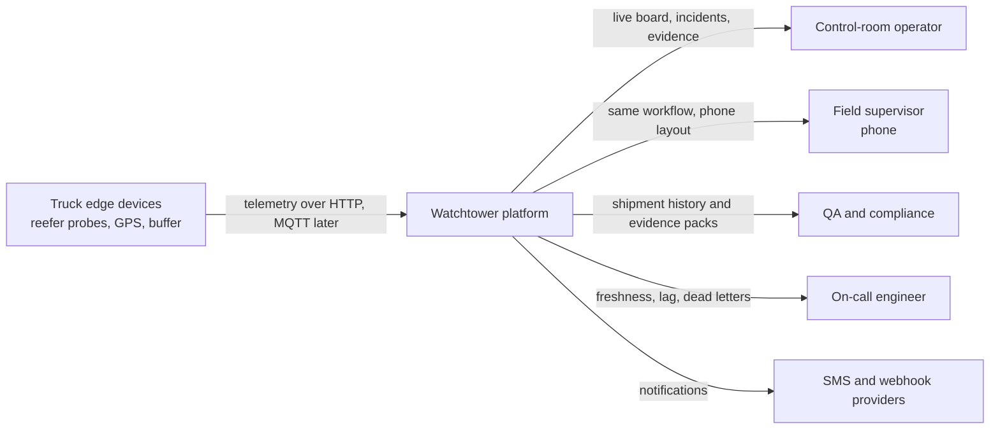
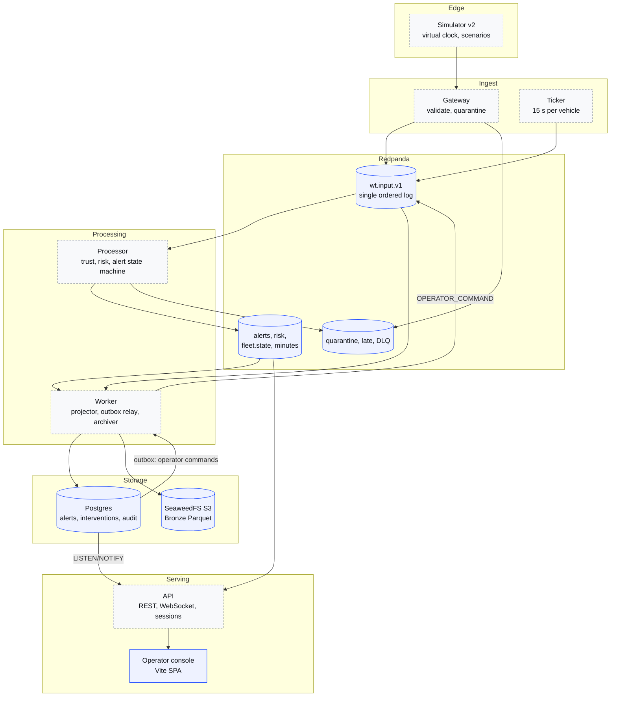
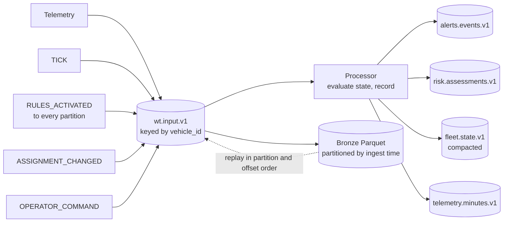
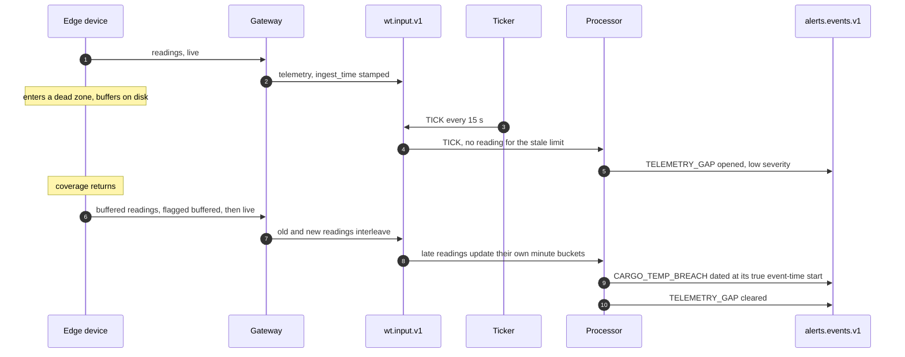
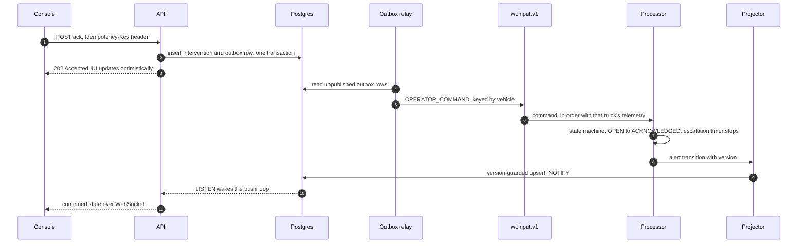

# Architecture Overview

This describes Watchtower's v2.1 target architecture: the rebuild plan as corrected by the [architecture review of 5 Oct 2026](review-2026-10-05.md) and ADRs 0005-0018. Every component is marked as either **built** or **designed**.

- **Built:** exists in this repository, with tests.
- **Designed:** specified in an ADR or the plan, but not implemented yet.

Status is as of the commit that last edited this file.

| Area | Status | Where |
| --- | --- | --- |
| Event contract (Avro), event identity | Built | `packages/contracts`, ADR-0002 |
| Domain: sequence-range dedup, minute buckets | Built (fold form; delta form per ADR-0016 still to do) | `packages/domain` |
| Producer factory with pinned partitioner | Built | `packages/platform`, ADR-0017 |
| Core infrastructure: Redpanda, Schema Registry, Postgres/PostGIS, SeaweedFS, topic init | Built | `infra/compose` |
| Database schema | Built | `migrations/versions/0001_core_schema.py` |
| Operator console | Built, on synthetic data | `apps/dashboard`, [console docs](../console/README.md) |
| Simulator v2 | In progress | `apps/simulator` |
| Gateway, ticker, processor, projector, outbox relay, archiver, API, notifier | Designed | ADRs 0005, 0006, 0008, 0018 |
| Analytics (dbt Silver/Gold), observability stack | Designed | Plan sections 11 and 14 |

## System context

## Containers

Solid blue boxes are built; dashed grey boxes are designed. The topics and schema exist and are tested, but no service produces to them yet.

## Event flow: one ordered input log

The central decision (ADR-0005): **everything that can change the processor's output is a record in `wt.input.v1`.** That means telemetry, `TICK`, `RULES_ACTIVATED`, `ASSIGNMENT_CHANGED` and `OPERATOR_COMMAND`. Because their relative order is recorded and archived, replaying Bronze reproduces every output. The plan's original design delivered ticks, rule changes and operator actions out of band, so replay could reproduce the final *state* but not the emitted *stream*.

Supporting rules:

- **Lateness** is `ingest_time - event_time`, computed per record. There is no partition watermark, so one fast device clock can't skew 2,000 other trucks (review finding 12).
- **Output IDs** are `uuid5(causing_record_id, ordinal)`, so any output traces back to the record that caused it, and replays produce the same IDs (ADR-0015).
- **Determinism contract:** temperatures are quantised to integer centi-°C, iteration is sorted, and only canonical output values are compared (ADR-0015).

## Sequence: a dead zone, then a buffered replay

The console already demonstrates the operator's side of this in its synthetic timeline. TRK-104's compressor fails inside the Okigwe dead zone. While out of coverage the truck shows a gap, and on reconnection the breach appears dated at its true start, earlier than when it was learned (`apps/dashboard/src/data/synthetic.test.ts`).

## Sequence: an operator acknowledges an alert

Why this shape (ADR-0006): the processor is the **single owner** of alert state. In the plan's original design, operators wrote alert state directly. The processor then never learned about a resolve, escalation couldn't see acknowledgements, and two independent version counters couldn't be reconciled. `interventions` remains the system of record for the *command*, and its `UNIQUE (alert_id, idempotency_key)` makes a double-click harmless.

## Topics

Created explicitly by `infra/compose/redpanda/create-topics.sh` before any consumer starts, with topic auto-creation switched off. That is the fix for v1's startup race, where the dashboard missed alerts for 297 s ([v1 audit](../audit/v1-baseline.md), defect 17).

| Topic | Partitions | Retention | Purpose |
| --- | --- | --- | --- |
| `telemetry.raw.v1` | 12 | 7 days | Gateway output, as accepted |
| `telemetry.quarantine.v1` | 3 | 30 days | Rejected readings, with reason codes |
| `wt.input.v1` | 12 | 7 days | The processor's single ordered input log (ADR-0005) |
| `telemetry.late.v1` | 3 | 30 days | Beyond the lateness window, kept for reconciliation |
| `telemetry.minutes.v1` | 12 | 3 days | Minute buckets for the projector |
| `risk.assessments.v1` | 12 | 14 days | Time-to-breach and exposure, with evidence |
| `alerts.events.v1` | 12 | 30 days | Alert transitions |
| `fleet.state.v1` | 12 | Compacted (`segment.ms` 10 min) | Latest state per vehicle |
| `{processor,projector,archiver,notifier}.dlq.v1` | 3 | 30 days | Dead letters after bounded retries |

Every key is `vehicle_id` (ADR-0017), so outputs are co-partitioned with the input log. Every producer comes from `watchtower_platform.make_producer`, which pins `murmur2_random`. librdkafka's default partitioner would otherwise send the same key to a different partition from Java tooling, silently splitting a truck's state.

## Data model

Defined in `migrations/versions/0001_core_schema.py` and exercised by `tests/integration/test_migrations.py`.

| Table | Role | Notable constraints |
| --- | --- | --- |
| `organizations` | Tenant | `org_id` on every business table |
| `vehicles`, `sensors` | Equipment | `vehicle_id` is a text natural key (`TRK-101`) everywhere |
| `cargo_profiles` | Limits per product | Nothing hard-coded in rules |
| `shipments`, `shipment_assignments` | What is on which truck, and when | One truck per shipment at a time |
| `vehicle_state` | Latest state per vehicle | Event-time guarded upserts |
| `risk_assessments` | Time-to-breach history | Append-only: UPDATE and DELETE revoked from the app role |
| `alerts` | Durable incidents | `alerts_one_live` partial unique index on `(org_id, dedup_key)`; dedup-key format enforced by CHECK; `version` for guarded projection |
| `interventions` | Operator commands | `UNIQUE (alert_id, idempotency_key)` |
| `rule_sets` | Versioned rules | Every alert stores the rule version it used |
| `processed_events`, `outbox` | Idempotency and reliable publishing | Partial index on unpublished outbox rows |
| `audit_log` | Tamper-evident trail | `hash = sha256(prev_hash ‖ canonical bytes)`; one genesis row; `UNIQUE (prev_hash)`, so the chain can't fork |
| `minute_series` | 72-hour minute buckets | Partitioned by UTC day; integer hundredths; `bucket_version` guard |

Services connect as members of the `watchtower_app` role, never as the table owner, because the owner bypasses the append-only revokes.

## Where to go next

- [Architecture review](review-2026-10-05.md): the 32 findings and the week-2 stream-engine spike criteria.
- [ADR index](../adr/README.md).
- [Rebuild plan](../../plan/Logistics%20Watchtower%202.0%20Rebuild%20Plan.md): scope, phases and gates.
