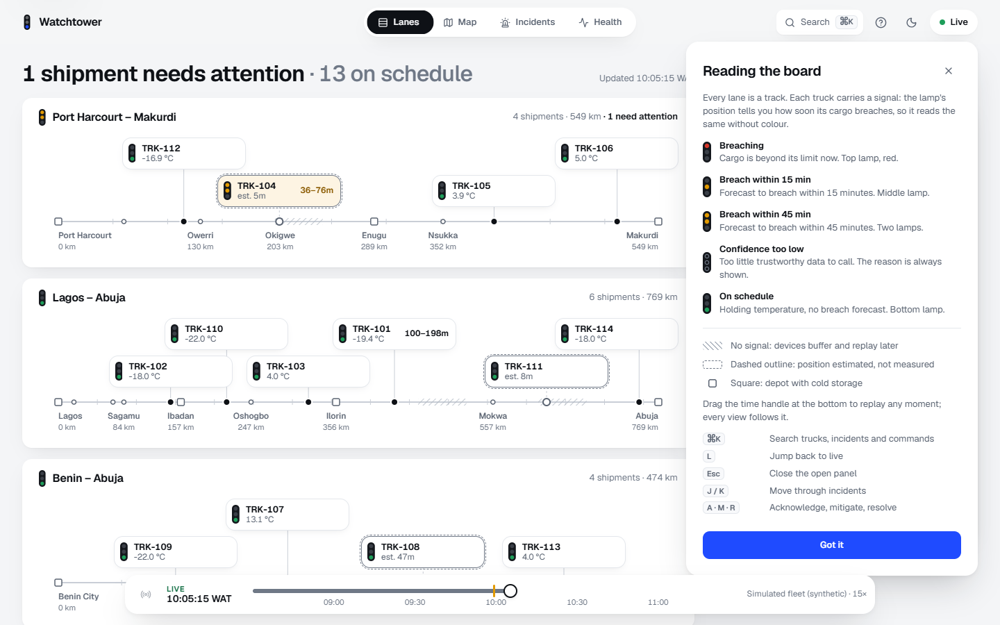
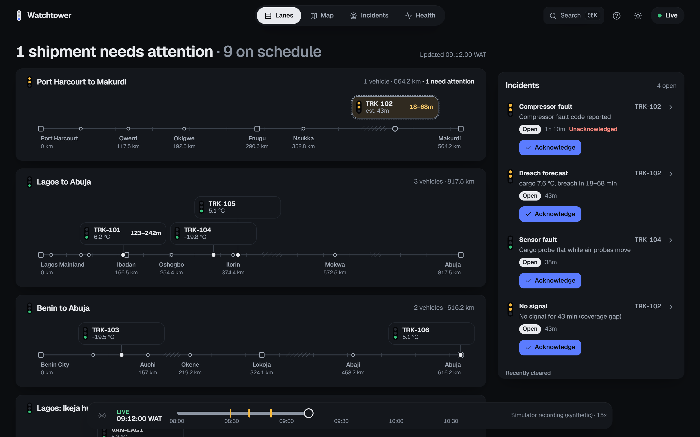
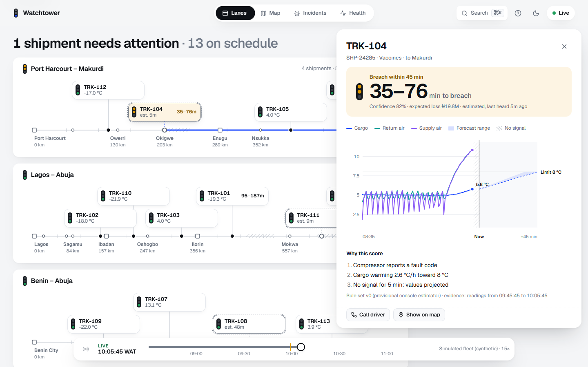
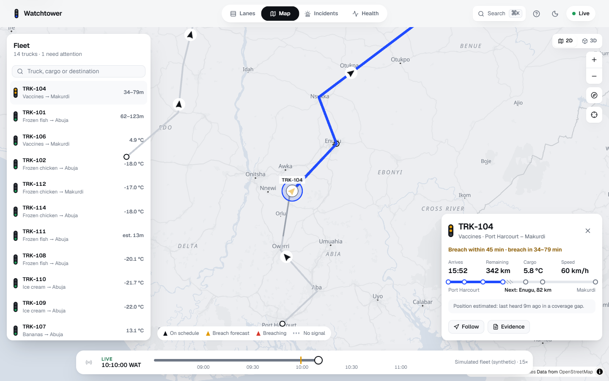
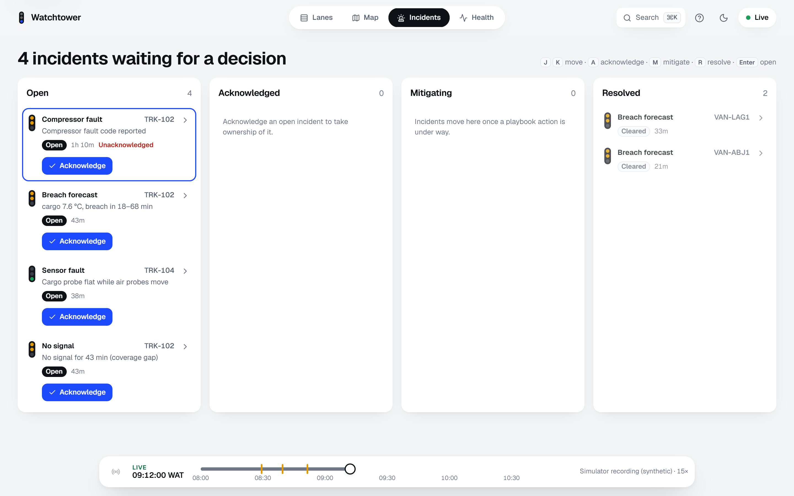
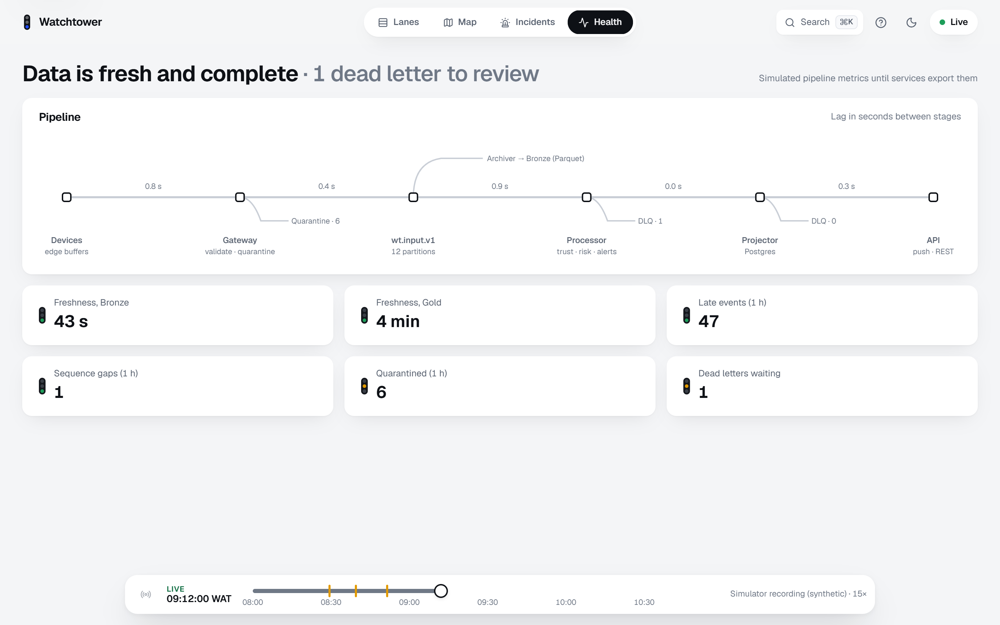

# The Operator Console


The console answers one question first: **which shipment will breach soonest, how sure are we, and what should I do?** It runs on desktop, tablet and phone with the same workflow (ADR-0010).

By default it replays the simulator's **showcase recording** (`apps/dashboard-fixtures/console_showcase`): a Thursday morning with 10 vehicles on real OSRM road and street geometry. Five inter-state trucks each carry one story, alongside a cross-dock and three city rounds in Lagos and Abuja:

| Vehicle | What happens | What the console shows |
| --- | --- | --- |
| TRK-101 | Compressor degrades on Lagos-Abuja | Breach forecast about 33 min before the cargo crosses 8 °C |
| TRK-102 | Compressor fault just before the Otukpo dead zone | Estimated position while offline; on reconnect, a breach dated to when it really started |
| TRK-103 | Cargo door open at 73 km/h | Door open while moving |
| TRK-104 | Cargo probe flatlines; the cargo itself is fine | Sensor fault, inferred from the probe going still while the air probes move |
| TRK-105 | Hijacked: leaves the route, stops, tracker cut | Off route (recorded position, no dead reckoning), then no signal |
| TRK-106 → VAN-ABJ2 | Cross-dock at the Abuja hub | The van carries no cargo until loaded, so its warm empty box raises nothing |

The console uses only what a real one could know. Temperatures are the device's probe samples, with noise, calibration and faults included. Readings become visible when the gateway would have received them, so dead zones show as estimates. Probe trust is inferred from the samples, never from the simulator's ground truth. `src/data/recording.test.ts` checks each row of the table. `?data=synthetic` switches to the seeded synthetic fleet (14 trucks, three corridors, scripted scenarios). Everything is synthetic. Both sources feed the data contract the API stream will deliver (see [Data contract](#data-contract)).

- **Code:** `apps/dashboard`
- **Design brief:** [`docs/design/console.md`](../design/console.md)
- **Stack decision:** [ADR-0014](../adr/0014-frontend-stack.md)

## Design language: Signal Box

Every lane is drawn as a **railway track diagram**. Towns are stations at their km posts, dead zones are hatched sections of line, and each shipment is a **describer tag** sitting at its position. Time-to-breach sets the tag's **signal aspect**.

This deliberately rejects the category default: a KPI tile row, a map in the middle, and glowing dots on navy (which is what v1 shipped). The map is one view of the line, not the whole console.

### Aspects

Lamp **position and count** carry the meaning, so colour never works alone (WCAG 2.2: use of colour).

| Aspect | Lamps lit | Meaning |
| --- | --- | --- |
| Clear | Bottom, green | No breach forecast in the horizon |
| Double yellow | Top and middle, yellow | Breach forecast within 45 min |
| Single yellow | Middle, yellow | Breach forecast within 15 min |
| Danger | Top, red | Cargo is beyond its limit now |
| Unknown | All three hollow | Confidence too low to call; the reason is always shown |

### Learning the grammar

A track diagram is unfamiliar at first, so the console teaches itself. On the first visit, a **"Reading the board"** panel opens with the aspect key drawn using real signal heads, the symbol key (depot, dead zone, estimated position), the replay hint and the keyboard shortcuts. It remembers that it has been seen (`wt-guide-seen` in local storage) and stays one click away in the header.



### Tokens

Defined in `apps/dashboard/src/styles/tokens.css` for two scene-driven themes: **Enamel** (light, for daylight and phones outdoors) and **Operating Centre** (dark, for a dim control room).

- **One accent, cobalt (`#1F4BFF` light, `#5B7CFF` dark).** It lights the selected route, focus and primary actions, and nothing else.
- **Lamp colours appear only as aspects:** red `#D7372A`, amber `#E29A00`, green `#1E9E5A`. Text uses darker `*-ink` variants that pass contrast.
- **Chart series colours were validated** with the dataviz palette validator (lightness band, chroma, colour-vision-deficiency separation, contrast) in both themes. The teal/violet pair sits in the 6-8 ΔE tritan band, which is legal only with secondary encoding, so the chart always carries a legend and direct labels.
- **Type:** Geist with tabular figures, on a fixed 1.2-ratio rem scale. Geist Mono is used only for IDs.
- **Surfaces:** white panels at 14 px radius with one soft offset shadow. Hairlines are reserved for track geometry.

### Motion grammar

Motion only ever conveys state.

| Duration | Use |
| --- | --- |
| 120 ms | Press and hover |
| 200 ms | State changes (lamp cross-fade, chips) |
| 280 ms | Hinged evidence layer, list reordering, lit route |
| 600 ms | Map camera only, so spatial moves keep orientation |

- **Easing:** a single curve, `cubic-bezier(0.2, 0, 0, 1)`.
- **Danger:** a new danger aspect shows one "proving" ring. An unacknowledged CRITICAL repeats it once every 10 s, and nothing else loops at rest.
- **Reduced motion:** with `prefers-reduced-motion`, every duration drops to 0 and the camera jumps.
- **Compositor-only properties:** animations use transforms, opacity and clip-path only. The Impeccable design detector reports zero layout-property transitions.

## Views

### Lanes (home)

Lanes are ordered by their worst aspect. The status headline ("1 shipment needs attention") is itself a control: it opens the most urgent shipment. The right column holds incident strips with their lifecycle action. On a crowded lane (more than six shipments, or more than two on screens narrower than 600 px), Clear shipments collapse to ticks so only the shipments that matter carry tags.



### Evidence layer

Selecting a tag opens a hinged layer over the board without leaving it. It shows:

- the verdict (time-to-breach as a p10-p90 range with its confidence);
- a temperature chart of cargo, return-air and supply-air **minute means** against the limit, with the forecast fan beyond "now" and no-signal periods hatched;
- "why this score", probe trust and the incident lifecycle.



The chart plots minute means, the same buckets the processor keeps. Raw 15-second readings showed every thermostat cycle and buried the trend.

### Map

MapLibre draws the basemap, and deck.gl draws vehicles in their own canvas.

- **Basemap:** OpenFreeMap's Positron style, recoloured at load time to the theme's tokens, so light and dark both belong to the product (`views/map/basemap.ts`).
- **Vehicles:** glide between timeline steps and point along their heading.
- **Selected truck:** its route ahead lights cobalt and its last hour fades behind it. Follow mode tracks it bearing-up.
- **3D:** pitches the camera, extrudes buildings and raises "signal posts" over at-risk trucks.
- **Trip card:** ETA, remaining distance, next stop and route progress with its dead zones.
- **Legend:** a compact chip explains the map's symbols.



### Incidents

A lifecycle board (Open, Acknowledged, Mitigating, Resolved), triaged from the keyboard: <kbd>J</kbd>/<kbd>K</kbd> to move, <kbd>A</kbd> acknowledge, <kbd>M</kbd> mitigate, <kbd>R</kbd> resolve, <kbd>Enter</kbd> open. Actions update optimistically and can be undone, and they're disabled during replay.



### Health

The data pipeline drawn in the same track-diagram grammar: stages are stations, lag sets each section's colour, and dead-letter queues are sidings. **The values are simulated** until the services export metrics (plan section 14), and the page says so.



### Phone

Full workflow parity: a bottom tab bar, compact lanes, and draggable bottom sheets with peek, half and full snap points on the map.

| Lanes | Map | Incidents |
| --- | --- | --- |
|  |  |  |

### Time handle and replay

One time handle drives every view at once. A "Drag to replay" hint sits on its track; dragging left replays the board, map, chart and queue together. <kbd>L</kbd> returns to live. Switching views uses a short cross-fade (View Transitions), skipped under reduced motion. <kbd>⌘K</kbd> opens a command palette for any truck, incident, view or command.

## Performance

Measured on the reference laptop: Intel i7-10510U with integrated UHD 620 graphics, Windows 11, Chromium via Playwright with `--use-angle=d3d11`, production build. The probe is `apps/dashboard/scripts/perf-map.mjs`. It opens the map in a **cold** browser profile, with no shader or HTTP cache, which is what a first-time visitor gets. It reports two numbers: how long until frames hold 50 fps for a full second, then frames per second and long-task time over the next 6 s.

| Map page | Settles in (cold) | Frame rate then | Long tasks |
| --- | --- | --- | --- |
| Before (deck.gl draws everything) | 23.2, 26.6 s | 59.2, 59.4 fps | 0 ms |
| Now, idle | 6.7, 5.8, 5.9 s | 59.4, 59.1, 58.9 fps | 0 ms |
| Now, vehicle selected | 5.9, 5.9, 6.6 s | 58.2, 57.9, 58.3 fps | 0 ms |

Earlier probes measured 59.8-59.9 fps after a 4 s warm-up. Recording-backed data, more layers and the first-visit guide later pulled that window down to 38-48 fps. The cause turned out to be **startup, not animation**: the steady state was always about 60 fps.

**Shader compilation was the freeze.** Profiling the first seconds showed 12 s of main-thread time in luma.gl's `_getLinkStatus`: on ANGLE/Direct3D 11 each deck.gl shader takes a long time to compile, and luma.gl waits for it synchronously. Timed per program (`scripts/perf-shaders.mjs`):

| Program | Link time, cold | Now |
| --- | --- | --- |
| deck.gl PathLayer, plain and dashed | 3.5 s + 3.0 s | MapLibre `line` layers |
| deck.gl ScatterplotLayer (discs, stops) | 0.7 s | Part of the vehicle icon; MapLibre `circle` layers for stops |
| deck.gl TextLayer (two programs) | 0.8 s + 0.7 s | HTML labels placed with `map.project` |
| deck.gl ColumnLayer (3D posts, on first 3D toggle) | 1.0 s | Billboarded signal-mast icons |
| deck.gl IconLayer (vehicles) | 0.7-0.9 s | Kept: the only deck.gl program left |
| MapLibre programs, each | 0.02-0.2 s | Unchanged |

Enabling parallel shader compilation (`KHR_parallel_shader_compile`, off by default in luma.gl) did not help. luma.gl reflects the program's attributes right after linking, and that blocks just the same. With a warm shader cache (a second visit), the old map already settled in about 4 s. So the fix matters most for first-time visitors, who are exactly the people a portfolio link reaches. The first switch to 3D went from 1.1-1.3 s of long tasks to none.

What made the difference:

- **One deck.gl shader.** deck.gl now draws only what moves every frame, with a single IconLayer program. Each vehicle's disc and arrow are one icon: a disc is round, so rotating it with the bearing is harmless. The selection halo and the 3D masts reuse the same program. Lines, stops and dead zones are MapLibre layers under the basemap's place names.

- **Production build vs dev server.** The earlier probe measured the dev server at 0.2-47.5 fps against 59.8-59.9 for the production build. React development mode, StrictMode double rendering and on-demand compilation cost the dev server most of its frames. Demos should run the production build.
- **Per-frame work cut to positions only.** The vehicle array is stable and mutated in place. Static layers are built once. Trails, routes and labels recompute only when the timeline step, selection or zoom bucket changes.
- **Separate canvases.** deck.gl renders in its own canvas over MapLibre. Interleaving them made every vehicle update repaint the whole vector basemap.
- **The MapLibre worker** is bundled explicitly (`?worker&url`). MapLibre finds its worker with a computed URL that Vite can't see, so production builds shipped without it and the basemap never decoded tiles.

**Bundle:** the console shell is about 116 KB of JavaScript plus 8 KB of CSS, gzipped. The map chunk (MapLibre and deck.gl) is lazy-loaded on the Map view.

**Targets, not yet measured:** 1,000 live vehicles at 60 fps; INP under 100 ms; LCP under 2.5 s on a mid-range phone ([design brief](../design/console.md), section 9).

## Data contract

The console consumes the shapes in `apps/dashboard/src/domain/types.ts`. The API's WebSocket stream (ADR-0018) will deliver the same shapes, so swapping the data source doesn't touch the UI.

- `Timeline`: `frameAt(t)` and `series(vehicleId, from, to)`, plus aspect markers for the time handle.
- `VehicleState`: position along a corridor, probe readings with trust status, door and compressor state, and `estimated` plus `lastFixAgeS`. A projection is never drawn as a measurement.
- `Shipment` and `Risk`: aspect, time-to-breach p10/p90, confidence, ordered reasons, expected loss and rule version.
- `Incident`: type, severity, lifecycle state, true event-time start, occurrence count and playbook actions.

`src/domain/risk.ts` is a **provisional** estimator: a straight-line fit for UI development only. The real model, an exponential fit with a p10-p90 range, already exists as a pure Python function (`packages/domain/src/watchtower_domain/forecast.py`) and will reach the console through the processor's risk assessments (ADR-0006). The synthetic timeline's scenarios are pinned by `src/data/synthetic.test.ts` (7 tests):

- Gradual degradation warns before it breaches.
- A dead-zone failure is dated at its true start.
- A door opened at speed and a stuck probe each raise their own incident.
- A defrost raises nothing.
- Healthy trucks raise only coverage gaps.

## Accessibility

- Aspects are shape-coded and always have a text equivalent. Tags expose a full accessible name (vehicle, cargo, aspect, range, estimated status).
- Every view is fully keyboard-operable. Focus rings, selection, the caret and scrollbars are themed rather than left at browser defaults.
- The map's fleet list is the accessible equivalent of the map.
- The time handle is a native range input with a spoken value ("09:42:15 WAT, replay").
- Motion respects `prefers-reduced-motion`.

## Develop

```bash
make console       # production build at http://localhost:4173
make console-dev   # hot reload at http://localhost:5173
make console-check # lint, types, tests, build (CI runs the same)
```

Media for these docs comes from `apps/dashboard/scripts/media.mjs`.
