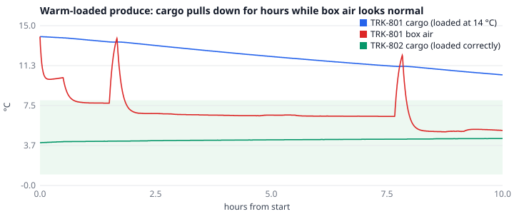
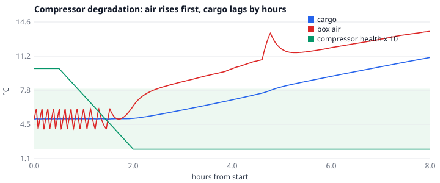
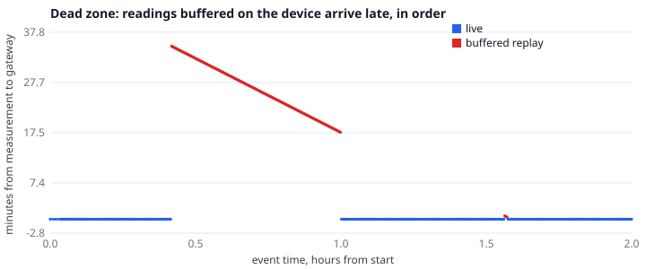

# Simulator validation

Generated by `uv run python -m watchtower_simulator.validation_report docs/simulator` from fresh, seeded runs: rerunning it reproduces this page and its charts exactly. It shows the simulator's sanity properties, not a calibration.

## Pull-down of a warm load

TRK-801 was loaded with produce at 14 °C against a 4 °C setpoint (1-8 °C allowed). Box air is back under 8 °C at **0.7 h**, but the cargo stays above 8 °C for **10.0 h** of the 10 h run: a reefer is built to hold temperature, not to pull down a warm load.

Checked by this script:

- while the compressor runs, the cargo never reads below box air, except in the 5 minutes after a defrost, when defrost heat still sits in the air: **holds**;
- the correctly loaded TRK-802 stays within 1-8 °C throughout: **holds**.

## Compressor degradation and lead time

Health falls from 1.0 to 0.2 over 90 minutes (bottoming at 2.0 h). The cargo crosses 8 °C **2.9 h** after that, because thermal mass makes the breach late. This is the lead time a time-to-breach forecast should earn.

## Duty cycle

| Case | Mean compressor duty after the first hour |
| --- | ---: |
| Healthy frozen trailer, hot day | 49% |
| Healthy pharma trailer | 27% |
| Degrading compressor (health 0.2) | 92% |
| Warm-loaded produce | 96% |
| Correctly loaded produce | 28% |

Rising duty at a steady temperature is the early sign of a struggling unit, and the `COMPRESSOR_DEGRADING` rule keys on it. Healthy units cycle; degraded and overloaded units run near flat out.

## Dead-zone replay

During the 35-minute outage TRK-501 keeps sampling, at the 10 s alarm rate because its compressor has faulted. 214 readings are buffered, then replayed in order once the link returns, alongside live data. The oldest arrives 35 minutes after it was measured. The cargo excursion starts inside the outage, so an alert must carry its true event-time start, not the time the data arrived.

## Fleet-day incident mix

20 seeded 24-hour days, each with 20 trucks, 4 vans on their own rounds and 2 cross-dock truck-van pairs. Incidents are drawn per vehicle-day from illustrative Poisson rates; generated counts should scatter around the mean (roughly ± 2√mean).

| Incident | Applies to | Expected (Poisson mean) | Generated |
| --- | --- | ---: | ---: |
| compressor_degradation | trucks and vans | 24.0 | 18 |
| compressor_fault | trucks and vans | 9.6 | 7 |
| door_open | trucks | 12.0 | 16 |
| sensor_flatline | trucks and vans | 14.4 | 10 |
| sensor_drift | trucks and vans | 14.4 | 15 |
| gps_jump | trucks and vans | 14.4 | 10 |
| reboot | trucks and vans | 24.0 | 29 |
| breakdown | trucks | 8.0 | 12 |
| tyre_blowout | trucks | 8.0 | 7 |
| hijack | trucks | 1.6 | 1 |
| link_outage | trucks and vans | 48.0 | 40 |

Truth guarantee: on a stressed day (20 injected incidents), **0** label failures: every injected incident appears in ground truth.

## What this model does not capture

Honest limits, so nobody mistakes the simulator for a calibrated digital twin:

- **No calibration to real units.** Thermal, reefer and environment parameters are plausible engineering values, not fitted to any manufacturer's data or field logs. Lead times and duty cycles show the right shape, not the right number for a specific trailer.
- **Air is one well-mixed node.** Real boxes stratify (warm air at the door and ceiling, cold near the evaporator), so probe placement matters in reality and doesn't here.
- **Door openings are binary.** No air-curtain or strip-curtain effectiveness, and no partial opening.
- **Weather is per truck,** not a spatial field: two trucks side by side can see different storms. There's no Harmattan dust effect on the unit, only on sunlight.
- **Roads are approximate.** Corridor geometry is real; road class is derived from distance to towns, not OSM tags. Checkpoint, toll and congestion rates are illustrative, not surveyed.
- **Cellular coverage is synthetic.** Dead zones are named placements and the link is a two-state Markov chain, not measured network data.
- **Customers and depots are invented.** Urban stops are synthetic; delivery windows and dwell times are plausible guesses.
- **Products are simple.** Respiration uses a Q10 rule, with no ripening, ethylene, chilling-injury dynamics or product quality model. Mean kinetic temperature and shelf life are left to the risk engine.
- **Bulk mode simplifies further** (see `bulk.py`): one cargo node, no weather or operations, and outages drop readings instead of buffering them.
- **People are absent.** Driver behaviour is a profile, not a decision-maker: no reactions to alerts, no theft resistance, no route changes.
